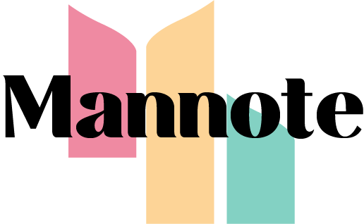

# Mann-Note: Empower Your Productivity



## About Mann-Note

Welcome to Mann-Note, where we believe productivity goes beyond just completing tasks quickly. It's about staying organized, focused, and inspired. Mann-Note is your all-in-one solution for achieving your productivity goals by seamlessly merging notes and plans into one cohesive system.

### Why Mann-Note?

In today's fast-paced world, managing your thoughts, ideas, and to-do lists can be overwhelming. Mann-Note simplifies this process by providing a unified platform to jot down notes, create detailed plans, and bring your ideas to life—all in one place. No more switching between multiple apps or losing track of important information.

### Key Features

1. **Note Taking**: Capture your thoughts, ideas, and inspirations effortlessly with our intuitive note-taking interface. Whether you're in a meeting, attending a lecture, or brainstorming, Mann-Note provides a clean canvas to record your thoughts in real-time.

2. **Task Management**: Transform your notes into actionable tasks with a click of a button. Prioritize and organize your to-do lists easily, ensuring you stay on top of commitments and responsibilities.

3. **Planning and Scheduling**: Plan your days, weeks, and months ahead with our powerful scheduling tools. Set reminders, deadlines, and milestones to stay accountable and achieve your goals.

4. **Collaboration**: Collaborate seamlessly with colleagues, friends, or family by sharing notes and plans. Whether it's a work project, group study session, or family vacation planning, Mann-Note makes teamwork effortless.

5. **Customization**: Personalize your Mann-Note experience with various themes, fonts, and layouts. Make your workspace truly yours.

### Our Mission

Mann-Note is more than a productivity tool; it's a commitment to helping you reach your full potential. Our mission is to empower individuals and teams to unlock their creativity, streamline workflows, and achieve their goals effortlessly. We simplify the complexities of modern life, making productivity a natural part of your daily routine.

### Join the Mann-Note Community

Experience the power of uniting notes and plans with Mann-Note. Whether you're a student, professional, entrepreneur, or anyone striving for greater productivity and organization, Mann-Note is here to support your journey.

Join our vibrant community today and start empowering your productivity. Together, we'll turn your ideas into action and your plans into achievements.

## Getting Started

- Visit [Mann-Note](https://mannote.vercel.app/) to get started with our platform.

## Contributing

We welcome contributions to Mann-Note! Here's how you can get involved:

1. **Fork the Repository**: Click the "Fork" button on the top right of this repository's page.

2. **Clone your Fork**: Clone your forked repository to your local machine using `git clone`.

```bash
git clone https://github.com/pranay101/Mannote.git
```
3. **Go into the Folder**: using `cd`.
```bash
cd Mannote
```
4. **Install Dependencies**:
```bash
npm i
```

5. **Run Development Server**
```bash
npm run dev
```
6. **Visit Localhost** visit [localhost:300](localhost:3000)

